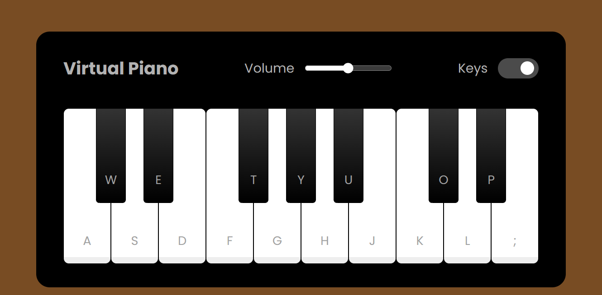

# Piano Simulator

In this project you can find a virtual piano made using the following technologies:

- HTML
- CSS
- JavaScript

## Explored Concepts

| Technology | Concepts                                                                                                                                                                                                                                                                                                                                                                                    |
| ---------- | ------------------------------------------------------------------------------------------------------------------------------------------------------------------------------------------------------------------------------------------------------------------------------------------------------------------------------------------------------------------------------------------- |
| HTML       | - Shortcuts in VSCode to create multiples list item elements in a single line instead of using copy and paste.   - Keep the code and elements organized by adding creating a container in the body to put the page layout inside it.  - Explored the usage of the **input** element in different ways/types (range and checkbox) to serve distinct purposes according to the project. |
| CSS        | - Use two different .css files: main and reset. In main.css we add all the style of the project, while the reset.css is to guarantee that even though different browsers use different default formats, the project will keep the same style in each of them.  - Explored the absolute and relative values of position property to create the switch effect in a input element.          |
| JavaScript | - Manipulate the DOM to add sound effects whenever the user chooses to click on the keys of the virtual piano, or to press the keyboard on the specific keys to play the piano.  - Work with adding event listeners to trigger an action determined by a function.  - Use events and their properties and methods to modify information according to a triggered action.              |

## Credits

This game is part of a bootcamp from [DIO](https://www.dio.me/en) and was developed during a lesson of [Felipe Aguiar](https://github.com/felipeAguiarCode).
